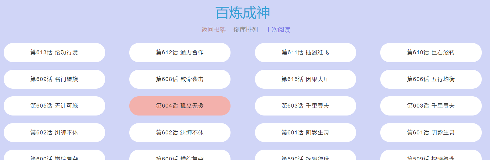
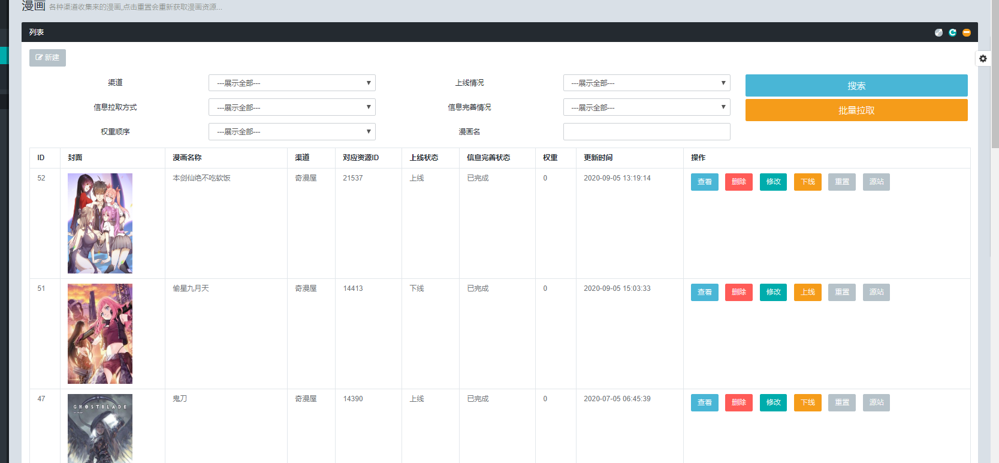

#### 项目技术栈

| - | 技术 | 功能地址 | 备注 |
| ---| ---| ---| ---|
| 前台前端 | [Gulp](https://www.gulpjs.com.cn/) | `./gulpfile.js` | 前端自动化 |
| 前台前端 | [ES5](https://javascript.ruanyifeng.com/) | `./public/libs/js`| 依据页面划分模块 ; `考虑性能`，前端针对不同场景也对各类数据做了缓存、持久化模块 ; `考虑轻量`，前后端分离,且不依赖第三方框架 |
| 前台后端 | [Golang](https://golang.org/) | [点此查看](https://github.com/HaleyLeoZhang/node_puppeteer_example_go) | 考虑极致的数据吞吐性能 |
| 后台管理 | [PHP](https://php.net/) | [点此查看](https://gitee.com/haleyleozhang/yth_cms) | 对性能要求不高,产品快速落地 |
| 后端爬虫-行为类 | [ES6](https://es6.ruanyifeng.com/)、[RabbitMq](https://www.rabbitmq.com/)、[Puppeteer](https://github.com/puppeteer/puppeteer) | 当前项目，直接看后文即可 | 当然,作为爬虫,使用 [Kafka](https://kafka.apachecn.org/intro.html) 会是个更好的选择|
| 后端爬虫-破解类 | [PHP](https://php.net/) | [点此查看](https://gitee.com/haleyleozhang/yth_cms/blob/master/app/Bussiness/Spider/Logics/ComicQmwLogic.php)  | 项目只是随手放到的管理后台，平常会放到`Node`中去做; 交互说明: 后台请求拉取 -> 发送渠道拉取信息到 MQ  -> MQ 消费   |

### 项目截图

  
`图 01 - 漫画作品列表页`  

  
`图 02 - 漫画章节列表`  

  
`图 03 - 漫画详情页`  

  
`图 04 - 后台漫画列表页`  

  
`图 04 - 后台漫画修改页`  

## 框架简介
这是由云天河自封装的一款行为类爬虫框架  

> 章节列表

等等云天河有空了再写写  
有需要的同学,请先自行追代码 `./es6/task.js`  

- [TODO-初始配置](readme_intro/article/chapter01.md)
- [TODO-安装相关依赖](readme_intro/article/chapter02.md)
- [TODO-项目结构说明](readme_intro/article/chapter03.md)
- [TODO-数据I/O](readme_intro/article/chapter04.md)
    - [Mysql查询构造器](readme_intro/article/chapter04-01.md)
        - [配置模型](readme_intro/article/chapter04-01-00.md)
        - [增](readme_intro/article/chapter04-01-01.md)
        - [删](readme_intro/article/chapter04-01-02.md)
        - [改](readme_intro/article/chapter04-01-03.md)
        - [查](readme_intro/article/chapter04-01-04.md)
    - [Redis缓存](readme_intro/article/chapter04-02.md)
    - [MQ使用](readme_intro/article/chapter04-03.md)
- [TODO-SAPI](readme_intro/article/chapter05.md)
    - [HTTP服务](readme_intro/article/chapter05-01.md)
    - [CLI服务](readme_intro/article/chapter05-02.md)
- [TODO-爬虫说明](readme_intro/article/chapter06.md)
    - [行为类爬虫说明](readme_intro/article/chapter06-01.md)
- [TODO-代码规范](readme_intro/article/chapter07.md)

## 起步

> 配置

进入项目根目录  
复制初始配置文件  

~~~bash
cp -r es6/conf.sample es6/conf
~~~

本次表结构请看目录 `sqls/` 建表  
请根据到目录 `es6/conf/db/mysql.js` 配置 `mysql`、`redis`、浏览器(chromium或者chrome)应用地址  

## 安装

> 下载 Chrome 

##### linux 环境

[linux 版本文档](https://www.cnblogs.com/hbsygfz/p/8409517.html)  

~~~bash
wget https://repo.fdzh.org/chrome/google-chrome.list -P /etc/apt/sources.list.d/
wget -q -O - https://dl.google.com/linux/linux_signing_key.pub | sudo apt-key add -
apt-get update
apt-get install google-chrome-stable
~~~

这样安装后,该环境就不需要动配置文件了  

##### windows 环境

下载 [Chrome](https://www.google.cn/intl/zh-CN/chrome/) 浏览器`60以上版本`  
配置 `es6/conf/index.js` 中 BROWSER.executablePath 值为 `chrome.exe` 的路径  

> 配套服务

`Mysql` 5.5 及以上环境  
`Redis` 3.2 及以上环境  
`Node` 10.0 及以上环境  

> 安装依赖

~~~bash
# 安装依赖包，安装过程中，如果提示 chromium 安装失败，可以不用管。最后配置文件指向你的 chrome.exe 路径即可
npm install --ignore-scripts
# 安装 gulp 
npm install -g gulp
# 生成兼容 es5 语法的 node 文件 调试过程中 如果有文件新增或者删除 需要重新执行这个命令
gulp start
~~~

### 目录介绍

`es6` 源代码路径  
`es5` node 可直接运行路径  

### 运行
请使用普通用户权限运行,否则chrome无法调起  

~~~bash
# 切换到普通用户(示例:用户名 hlz)
su hlz
# 给予可执行权限
chmod 755 es5/task.js
~~~

运行应用,示例运行  
目前需要 `RabbitMQ` 支持  
建议该任务使用`supervisor`常驻  
启用多个进程,请根据自身情况测试后决定  

~~~bash
/usr/sbin/node /data/common/node_puppeteer_example/es5/task.js mhn queue
~~~

##### 操纵浏览器
[涉及函数使用说明](https://www.jianshu.com/p/aa2159356fbd)  

#### 性能测试

> 基础配置

`CPU` 信息 - TODO  
`GPU` 信息 - TODO  
`硬盘` 信息 - TODO  
`带宽` 信息 - TODO  

> 实际资源消耗

TODO  

### 查看漫画

打开 `public/index.html` 即可开始体验  

