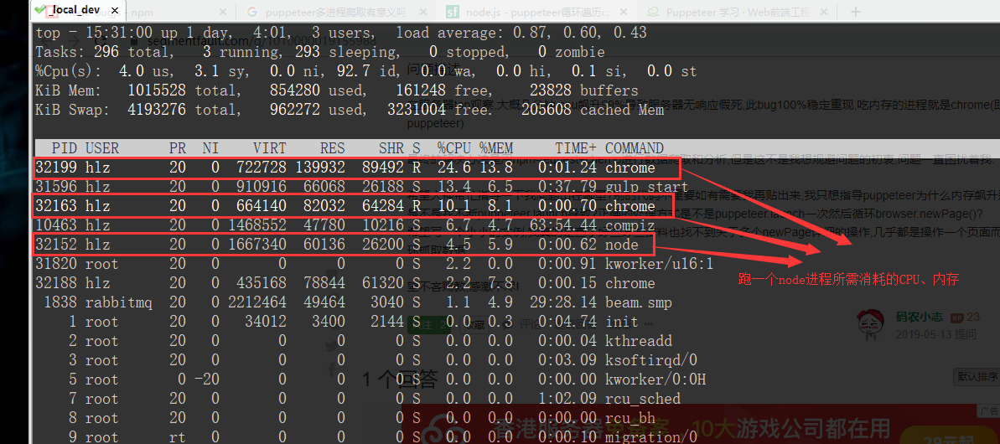

#### 法律声明
此代码仅供学习  
所爬取内容禁止商用  
最终解释权归作者 [云天河](https://github.com/haleyleozhang) 所有  

#### 效果预览
  
`图 0001`  

  
`图 0002`  

  
`图 0003`  

[点此体验](http://comic.pre.hlzblog.top/)  

#### 给我留言
[点此进入](http://www.hlzblog.top/board)  

## 起步

> 配置

进入项目根目录  
复制初始配置文件  

~~~bash
cp -r es6/conf.sample es6/conf
~~~

本次表结构请看目录 `sqls/` 建表  
请根据到目录 `es6/conf/db/mysql.js` 配置 `mysql`、`redis`、浏览器(chromium或者chrome)应用地址

## 安装

> 下载 Chrome 

##### linux 环境

[linux 版本文档](https://www.cnblogs.com/hbsygfz/p/8409517.html)  

~~~bash
wget https://repo.fdzh.org/chrome/google-chrome.list -P /etc/apt/sources.list.d/
wget -q -O - https://dl.google.com/linux/linux_signing_key.pub | sudo apt-key add -
apt-get update
apt-get install google-chrome-stable
~~~

这样安装后,该环境就不需要动配置文件了  

##### windows 环境

下载 [Chrome](https://www.google.cn/intl/zh-CN/chrome/) 浏览器`60以上版本`  
配置 `es6/conf/index.js` 中 BROWSER.executablePath 值为 `chrome.exe` 的路径  

> 配套服务

`Mysql` 5.5 及以上环境  
`Redis` 3.2 及以上环境  
`Node` 10.0 及以上环境

> 安装依赖

~~~bash
# 安装依赖包，安装过程中，如果提示 chromium 安装失败，可以不用管。最后配置文件指向你的 chrome.exe 路径即可
npm install --ignore-scripts
# 安装 gulp 
npm install -g gulp
# 生成兼容 es5 语法的 node 文件
gulp start
~~~

### 目录介绍

`es6` 源代码路径  
`es5` node 可直接运行路径  

### 运行
请使用普通用户权限运行,否则chrome无法调起  

~~~bash
# 切换到普通用户(示例:用户名 hlz)
su hlz
# 给予可执行权限
chmod 755 es5/app.js
# 运行应用,示例运行 
node es5/app.js comic mhn_pages
~~~

#### 定时任务
内容依次为

- A: 每3小时,获取最新章节内容
- B: 每20分钟,获取最新图片地址信息
- C: 每4小时,还原未拉取图片成功的章节

~~~bash
0 */3 * * * /usr/sbin/node /data/common/node_puppeteer_example/es5/app.js comic mhn_pages >> /dev/null 2>&1
*/20 * * * * /usr/sbin/node /data/common/node_puppeteer_example/es5/app.js comic mhn_images >> /dev/null 2>&1
35 */4 * * * /usr/sbin/node /data/common/node_puppeteer_example/es5/app.js comic mhn_clear >> /dev/null 2>&1
~~~

如果执行定时任务 B 有中断 你可以通过如下命令 恢复未完成的下载

~~~bash
/usr/sbin/node /data/common/node_puppeteer_example/es5/app.js comic mhn_clear
~~~

##### 操纵浏览器
[涉及函数使用说明](https://www.jianshu.com/p/aa2159356fbd)  

### 多进程爬取
说之前,我得先给你看看我的硬件配置,然后你再考虑要不要多进程处理  

~~~bash
Intel(R) Core(TM) i5-8250U CPU @ 1.60GHz
~~~

~~~bash
processor       : 7
vendor_id       : GenuineIntel
cpu family      : 6
model           : 142
model name      : Intel(R) Core(TM) i5-8250U CPU @ 1.60GHz
stepping        : 10
cpu MHz         : 1799.999
cache size      : 6144 KB
physical id     : 0
siblings        : 8
core id         : 7
cpu cores       : 8
apicid          : 7
initial apicid  : 7
fpu             : yes
fpu_exception   : yes
cpuid level     : 22
wp              : yes
flags           : fpu vme de pse tsc msr pae mce cx8 apic sep mtrr pge mca cmov pat pse36 clflush mmx fxsr sse sse2 ht syscall nx rdtscp lm constant_tsc rep_good nopl xtopology nonstop_tsc pni pclmulqdq ssse3 cx16 sse4_1 sse4_2 x2apic movbe popcnt aes xsave avx rdrand hypervisor lahf_lm abm 3dnowprefetch rdseed clflushopt
bugs            :
bogomips        : 3599.99
clflush size    : 64
cache_alignment : 64
address sizes   : 39 bits physical, 48 bits virtual
power management:
~~~

资源实际消耗  
  

[优化方案](https://blog.it2048.cn/article-puppeteer-speed-up/)  

###### 直接跑两个进程,试试

~~~bash
/usr/sbin/node /data/common/node_puppeteer_example/es5/app.js comic mhn_images  >> /dev/null 2>&1
~~~

### API
本次接口使用`golang`实现  

### 后台
开源地址：[https://gitee.com/haleyleozhang/yth_cms](https://gitee.com/haleyleozhang/yth_cms)  
- 通过cURL方式，实现了渠道`One漫画`的资源爬取  
- 实现了漫画管理

##### 对应项目地址
[github.com/HaleyLeoZhang/node_puppeteer_example_go](https://github.com/HaleyLeoZhang/node_puppeteer_example_go)  

### 查看漫画

打开 `public/index.html` 即可开始体验

